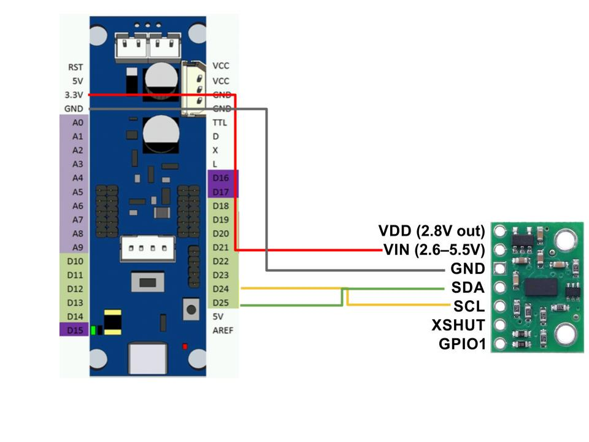

# Apple Vision Bridge Firmware

This repository contains the firmware used to bridge a VL53L0X distance sensor and ROS. The contained sketch will setup the VL53L0X to measure once every 100ms and publish every measurement to the `apple_dist` topic as a `sensor_msgs/Range` message.

## Building/Uploading this Sketch

### Using the Arduino IDE

Follow the [ROBOTIS IDE setup instructions](https://emanual.robotis.com/docs/en/parts/controller/opencm904/#arduino-ide) for your appropriate OS. After completing the setup, you should be able to build/upload this sketch in the IDE.

### Using the Arduino CLI

Follow [these instructions](https://arduino.github.io/arduino-cli/dev/installation/) to install the Arduino CLI. Once installed, you can install the OpenCM9.04 Core using the following command:
```sh
arduino-cli core install --additional-urls https://raw.githubusercontent.com/ROBOTIS-GIT/OpenCM9.04/master/arduino/opencm_release/package_opencm9.04_index.json OpenCM904:OpenCM904
```

If you're using Linux, you'll also need to add the correct udev rules:
```sh
wget https://raw.githubusercontent.com/ROBOTIS-GIT/OpenCM9.04/master/99-opencm-cdc.rules
sudo cp ./99-opencm-cdc.rules /etc/udev/rules.d/
sudo udevadm control --reload-rules
sudo udevadm trigger
```

With the core setup, you should now be able to compile/upload the sketch:
```
arduino-cli compile --fqbn OpenCM904:OpenCM904:OpenCM904 applevisiondist
arduino-cli upload -p /dev/ttyACM0 --fqbn OpenCM904:OpenCM904:OpenCM904 applevisiondist
```

## Connecting the Sensor



This project uses a [Pololu VL53L0X breakout](https://www.pololu.com/product/2490), but any VL53L0X breakout will work. The pin connections are shown in the table below:

| OpenCM 9.04 Pin | VL53L0X Pin |
|-----------------|-------------|
| 3.3V            | VIN         |
| GND             | GND         |
| D25             | SDA         |
| D24             | SCL         |

## Running in WSL

You can use [usbipd-win](https://github.com/dorssel/usbipd-win) to proxy the serial port into WSL:
1. Update your WSL instance with `wsl --update`
2. In your WSL instance install usbip:
```
sudo apt install linux-tools-5.4.0-77-generic hwdata
sudo update-alternatives --install /usr/local/bin/usbip usbip /usr/lib/linux-tools/5.4.0-77-generic/usbip 20
```
3. Download a usbipd-win release from the [releases page](https://github.com/dorssel/usbipd-win/releases) and install it on windows. You will probably need to reboot.
4. In an admin command prompt `wsl --list` to show your WSL distributions and `usbipd wsl list` to show USB devices on the host.
5. Run `usbipd wsl attach --busid <usb busid> -d <wsl distribution>` to attach a USB device to your WSL.

> You'll need to re-run the attach command every time the device is reconnected, including if the device resets or self-disconnects. This means that to upload a sketch you'll want to [force the OpenCM board into bootloader mode](https://emanual.robotis.com/docs/en/parts/controller/opencm904/#user-button) so that the port doesn't reset during the upload.

> If you find that you can't access the exposed serial port without root in the WSL, it's likely that udev is disabled.  You can start udev using `service udev restart`. If this throws the error: `* udev does not support containers, not started` modify `/etc/init.d/udev` to remove the line checking for this error and try again. Once udev starts successfully use `sudo udevadm trigger` to fix the device permissions.
